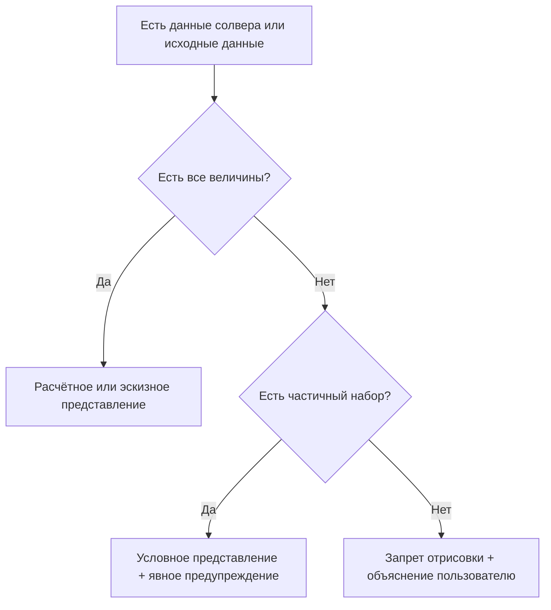
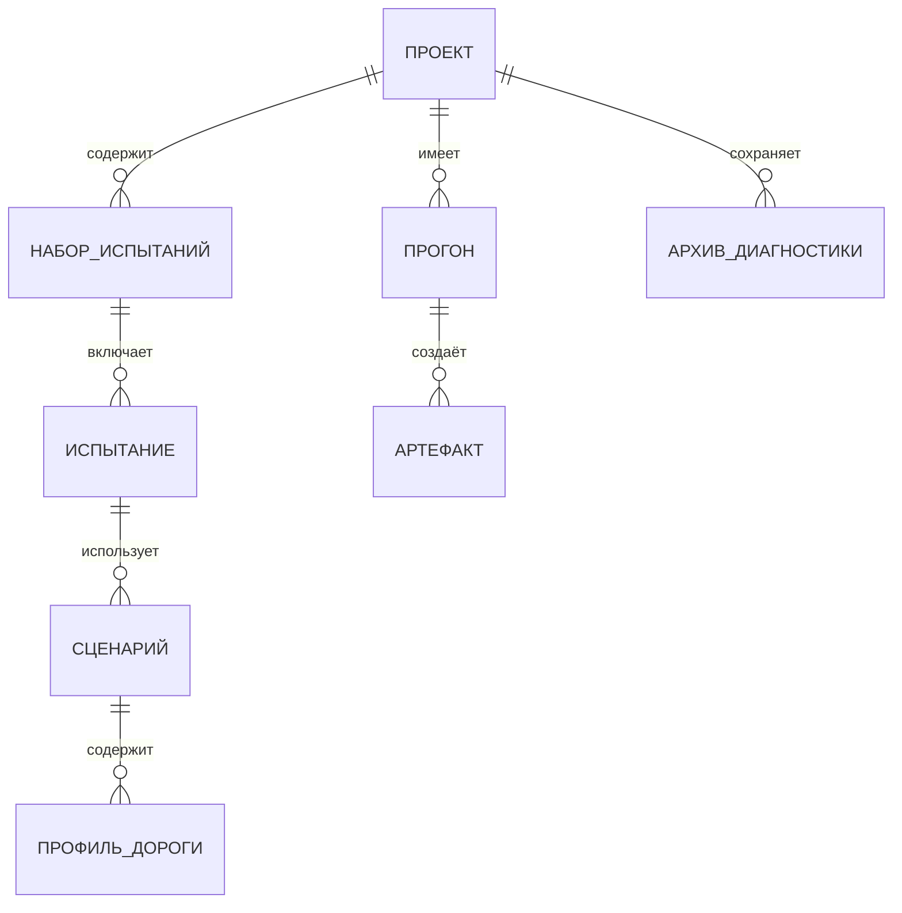

# Требования и лучшие практики разработки графических интерфейсов инженерных настольных приложений Windows для систем автоматизированного проектирования, производства и инженерного анализа

## Исполнительное резюме

Инженерные настольные приложения Windows класса **система автоматизированного проектирования (CAD)**, **система автоматизированного производства (CAM)** и **система инженерного анализа (CAE)** обычно строятся вокруг центральной рабочей области (видовой экран или документ), а вся остальная функциональность обслуживает работу в этой области через прикрепляемые панели, панели свойств, обозреватель модели, контекстные команды и быстрый доступ к командам. Этот «центральный документ + окна инструментов вокруг» прямо описан в рекомендациях по оболочке Visual Studio (как зрелом эталоне сложного инструментального приложения): документные окна занимают центральную область, а окна инструментов поддерживают работу вокруг неё и должны быть совместимы с докованием, автоскрытием и вторым монитором. citeturn0search1

Для Windows‑настольных инженерных приложений критичны следующие «сквозные» атрибуты качества, которые должны быть зафиксированы как требования и проверяться на приёмке:

Нативность Windows в поведении окна, команд и взаимодействий — Microsoft рекомендует тестировать интерфейс на разных размерах окна и масштабах, обеспечивать корректную прокрутку и панорамирование при «сжатии» окна, а также опираться на контекстные команды и сочетания клавиш как на первоклассный механизм взаимодействия. citeturn2search1turn8search0

Доступность и «клавиатура как равноправный способ работы» — Microsoft трактует доступность как ядро качества: приложение должно быть полностью управляемым с клавиатуры, корректно поддерживать программы экранного доступа, а для этого элементы интерфейса должны иметь доступные имена, роли и значения в инфраструктуре Microsoft UI Automation. citeturn2search0turn2search10turn0search0

Корректное масштабирование точек на дюйм на каждом мониторе — Microsoft рекомендует режим **Per‑Monitor DPI версии V2 (Per‑Monitor V2 DPI)** для настольных приложений, чтобы избежать размытости при переносе окна между мониторами; при обработке сообщения WM_DPICHANGED важно использовать прямоугольник, рекомендованный системой, иначе возможны циклы смены масштабирования и проблемы с относительным положением указателя мыши. citeturn6search1turn0search3

Высокая отзывчивость и низкая фоновая нагрузка — Microsoft отдельно публикует практики, требующие минимизации фоновой работы (не будить центральный процессор таймерами в фоне, не расходовать ресурсы, когда приложение не видно пользователю) и снижения использования памяти и диска; для серьёзных инструментов рекомендуется измерять ключевые сценарии взаимодействия и ставить цели по отзывчивости, например с помощью Event Tracing for Windows (ETW). citeturn2search7turn2search8turn2search3turn6search2

Паттерны CAD/CAM/CAE по управлению сложностью — в промышленной практике это выражается в «палитрах/панелях», которые могут быть прикреплены, закреплены, плавать, автоскрываться и группироваться вкладками (AutoCAD и DraftSight), а также в «панели свойств», которая позволяет задавать параметры без перекрытия графической области модальными диалогами (SOLIDWORKS PropertyManager). citeturn7search7turn7search6turn7search2turn7search0

В контексте миграции из веб‑интерфейса в настольный графический интерфейс пользователя (GUI) ключевым становится отдельное требование: **функциональные потери запрещены**, поэтому «матрица соответствия веб → настольный интерфейс» должна быть обязательным артефактом. В репозитории проекта уже жёстко зафиксированы принципы: не прятать страницы, не вводить скрытые режимы «expert/legacy», иметь одну явную кнопку диагностики и не «придумывать физику» в визуализации при отсутствии данных — эти принципы нужно перенести в настольную архитектуру как запреты и критерии приёмки. fileciteturn12file0L1-L1 fileciteturn18file0L1-L1 fileciteturn20file0L1-L1

## План исследования и приоритет источников

### Краткий план исследования

Информационные потребности, которые нужно закрыть, чтобы требования были практичными и проверяемыми:

Понять «нормы Windows» для настольных приложений: поведение окна, команды, прокрутка, взаимодействия, производительность, доступность и масштабирование точек на дюйм. citeturn2search1turn6search1turn2search0turn2search10

Собрать «боевые» паттерны CAD/CAM/CAE: центральный видовой экран, панели и палитры, панель свойств вместо диалогов, поиск команд, навигационный куб. citeturn7search7turn7search0turn7search9turn7search11

Сопоставить эти паттерны с техническими стеками Windows desktop, которые реально используются в инженерных программах: Win32, Windows Presentation Foundation (WPF), Windows App SDK (WinUI 3), Qt Widgets (включая док‑окна и сохранение раскладки). citeturn6search1turn6search4turn3search2turn3search8turn3search7

Извлечь проектные ограничения и текущую функциональность из GitHub, чтобы построить матрицу «веб → настольный интерфейс» и избежать потери функций при миграции. fileciteturn14file0L1-L1

### Приоритет источников

| Приоритет | Источник | Почему это «основание требований» |
|---|---|---|
| Высокий | Microsoft Learn (Windows apps, Win32, Windows App SDK, .NET) | первичные нормы: доступность (Microsoft UI Automation), Per‑Monitor V2 DPI, производительность, ожидания пользователей Windows citeturn2search1turn6search1turn2search10turn2search7 |
| Высокий | Официальная документация Autodesk и Dassault/SOLIDWORKS | паттерны CAD: палитры, рабочие пространства, панель свойств, навигационный куб, поиск команд citeturn7search7turn7search0turn7search11turn7search10 |
| Высокий | Официальная документация Qt | практическая модель прикрепляемых окон инструментов, сохранение компоновки, высокое значение точек на дюйм citeturn3search2turn3search8turn3search7 |
| Средний | Microsoft Visual Studio UX Guidelines | зрелый канон «документ + окна инструментов», состояния докования, требования к клавиатуре и консистентности citeturn0search1turn8search3 |
| Средний | Русскоязычные версии Microsoft Learn | терминология и нормативы, которые удобно включать в русскоязычные спецификации (в том числе высокое значение точек на дюйм и стек .NET) citeturn6search1turn5search3turn6search4 |

## Анализ репозитория GitHub barmaleii77-hub/pneumo2

### Функциональная структура и ограничения, которые уже зафиксированы

В репозитории barmaleii77-hub/pneumo2 текущая оболочка интерфейса реализована на Streamlit (веб‑интерфейс), и файл app.py прямо фиксирует цели: единая навигация, отсутствие скрытых режимов «expert/legacy», доступность страниц всегда и наличие одной кнопки «Диагностика» в боковой панели, а также защита от падений и автосохранение диагностического архива при ошибках. fileciteturn12file0L1-L1

Реестр страниц (page_registry.py) задаёт структуру меню как секции и группы, поддерживает маркировку статуса («готово», «в разработке», «сломано») и архивирование дублей так, чтобы инженеру не попадались «мертвые ссылки» и не терялась функциональность из‑за слияний. Это по сути уже «каталог возможностей», пригодный для построения матрицы «веб → настольный интерфейс». fileciteturn14file0L1-L1

В README репозитория явно выделен «контракт» и «закон совместимости» (смысл: никаких выдуманных параметров и алиасов), а также важная инженерная политика визуализации: при отсутствии колоночных данных дороги визуализация не должна «придумывать физику», а должна восстанавливать профиль дороги из входного описания испытания, а динамику брать только из результата расчёта. Это — готовая формулировка правила «честности графики». fileciteturn18file0L1-L1

Документ SEND_BUNDLE_FLOW.md описывает целевой эксплуатационный поток: после закрытия приложения должен получаться один архив, пригодный для отправки, содержащий логи и артефакты, отчёты качества логов, снимок окружения, отчёт валидации; и отдельно подчёркнуто, что в инструменте отправки предусмотрена «одна кнопка». Это хороший пример «диагностика как первоклассная функция», которую нельзя спрятать глубоко. fileciteturn20file0L1-L1

Документ LOGGING_SCHEMA_UI.md формализует строгую схему логов пользовательского интерфейса (JSON Lines), где валидатор проверяет обязательные поля и монотонность последовательности событий, а важность валидного events.jsonl прямо объявлена критичной для сборки архива диагностики. Для инженерного продукта это означает: интерфейс и диагностика проектируются вместе, а не «после». fileciteturn19file0L1-L1

### Следствие для настольной миграции

Миграция из веб‑оболочки в настольный интерфейс не должна менять контракт продукта: «нет скрытых режимов», «не теряем страницы», «диагностика первоклассна» и «визуализация не лжёт». При этом переход в Windows desktop открывает возможность реализовать CAD‑паттерны нативно: прикрепляемые панели, независимое окно мнемосхемы на втором мониторе, командная поверхность, поиск команд, настоящий видовой экран и корректное масштабирование точек на дюйм на каждом мониторе. citeturn0search1turn6search1turn7search7 fileciteturn20file0L1-L1

## Требования и лучшие практики Windows desktop для CAD/CAM/CAE

### Нативность Windows и устойчивость к изменению размеров окна

Microsoft в best practices подчёркивает, что приложение должно быть работоспособным на различных размерах окна, масштабах и значениях точек на дюйм; интерфейс должен оставаться функциональным даже при уменьшении окна до малых размеров, а прокрутка и панорамирование должны помогать получать доступ к элементам, которые «вылезли» за видимую область. citeturn2search1

Microsoft также рекомендует придерживаться ожидаемых пользователями Windows взаимодействий: поддержка разных устройств ввода, контекстные команды, согласованные операции с текстом (выделение, копирование; вырезать/вставить для редактируемого текста) и общий принцип «если команда используется часто и есть место — вынеси её наружу». citeturn2search1turn8search0

Практический вывод для CAD/CAM/CAE: базовая оболочка должна быть «безопасной» к ресайзу. Любые панели (обозреватель, свойства, результаты, диагностика) не должны разрушать компоновку; в крайнем случае они должны сжиматься, уходить во вкладки или в автоскрытие, а центральная рабочая область (видовой экран) должна оставаться доступной.

### Документ и видовой экран как центр, а окна инструментов как окружение

Microsoft Visual Studio UX Guidelines называют два основных типа окон: документные окна и окна инструментов. Документные окна занимают центральную область, а окна инструментов поддерживают работу вокруг и могут быть прикреплёнными, автоскрываемыми, автоматически показываемыми, плавающими и даже открываться вкладкой внутри области документов. Важен также принцип: контент окон инструментов должен быть управляем с клавиатуры. citeturn0search1

Qt даёт такую же модель на уровне компонентов: QDockWidget — это док‑окно (палитра/служебное окно), которое можно доковать вокруг центрального виджета QMainWindow или делать плавающим; QMainWindow поддерживает сохранение и восстановление состояния раскладки (позиции док‑окон и панелей инструментов). citeturn3search2turn3search8

Autodesk в документации AutoCAD описывает палитры как «вторичные окна» и прямо перечисляет режимы: докование, «якорь» слева/справа, автоскрытие; рабочие пространства могут управлять отображением и внешним видом палитр. Это особенно релевантно инженерным системам, где пользователь хочет «свою» раскладку и второй монитор. citeturn7search7turn7search6

Требование для CAD/CAM/CAE под Windows: центральная рабочая область должна быть «по умолчанию главным объектом внимания», а все панели — прикрепляемыми и запоминающими состояние, чтобы инженер мог выстроить рабочее место под себя и не терять раскладку между запусками. citeturn0search1turn3search8turn7search7

### Панель свойств вместо каскада диалогов

SOLIDWORKS описывает PropertyManager как механизм, который открывается в левой панели и показывает свойства сущности или операции так, чтобы пользователь мог задавать свойства **без диалога, перекрывающего графическую область**. Это один из самых важных паттернов профессионального инженерного интерфейса: свойства редактируются всегда «рядом со сценой», а не в бесконечных модальных формах. citeturn7search0

Требование: «панель свойств» должна быть контекстной (зависит от выбранного объекта или активной операции), должна поддерживать полный набор параметров, иметь встроенную справку и предупреждения, и быть пригодной для выноса на второй монитор.

### Командная поверхность: меню, панели инструментов, лента команд

Windows Ribbon Framework позиционируется Microsoft как «богатая система представления команд», предлагающая альтернативу классическим меню и панелям инструментов и заявляющая соответствие Windows UI guidelines, поддержку доступности, тем и высокого значения точек на дюйм. При этом фокус смещается на модель «команда» (намерение), а не «конкретная кнопка». citeturn1search2

В актуальных рекомендациях Microsoft по меню и контекстным меню подчёркивается: меню экономят место, но если команда частая — лучше дать её напрямую; контекстное меню привязано к конкретному объекту и содержит вторичные команды; для операций «вырезать/копировать/вставить» ожидается контекстное меню на текстовых элементах. citeturn8search0turn2search1

В Win32 UX Guide (хотя документ отмечен как созданный для Windows семь) подчёркивается общий принцип: командное представление должно соответствовать типу программы, типам окон и частоте использования команд; и отдельно сказано, что команды не должны быть доступны только через контекстное меню (контекстное меню — альтернативный путь, а не единственный). citeturn8search2

Практический вывод: для CAD/CAM/CAE допустимы варианты «лента команд (Ribbon)», «панели инструментов», «командная панель + вкладки», но при любом выборе обязателен единый командный слой: команды должны быть доступны через основной интерфейс, контекстные команды и сочетания клавиш.

### Поиск команд и «командная строка» как ускоритель для инженера

AutoCAD документирует режим подсказок при вводе: список предложений может включать команды, системные переменные и именованный контент; есть режим поиска по середине слова (mid‑string search), а также опция автокоррекции типичных опечаток, которая «обучается» на истории ошибок пользователя. citeturn7search9turn7search10

Для CAD/CAM/CAE под Windows это превращается в требование:

Единый «поиск команд» должен искать не только команды, но и настройки, сущности проекта (испытания, прогоны, сценарии), а также открывать соответствующий экран/панель и показывать «где это находится» в интерфейсе — особенно важно при миграции из веб‑версии, где расположение функций было другим. citeturn7search10turn2search1

### Политика модальных и немодальных диалогов

Microsoft разделяет модальные и немодальные диалоги: модальные подходят для критичных, редких, одноразовых действий; немодальные — для частых и повторяющихся задач. Также отмечается, что диалог не должен требовать прокрутки (лучше переработать компоновку), а для длительных операций важно показывать ход выполнения и по возможности позволять продолжить работу. citeturn1search0

Для инженерного приложения это означает:

Параметры выбранного объекта и параметры операции редактируются в панели свойств или немодальной форме (при необходимости — докуемой), а модальные диалоги остаются для критичных подтверждений, опасных операций и мастеров шагов, где без последовательности нельзя. citeturn1search0turn7search0

### Доступность: клавиатура, программы экранного доступа и Microsoft UI Automation

Microsoft описывает доступность как проектную дисциплину, а не финальную проверку. В обзоре доступности говорится, что приложения должны поддерживать клавиатуру и программы экранного доступа; ключевым является наличие доступного имени для каждого элемента. citeturn2search0turn4search2

Microsoft UI Automation описывается как инфраструктура доступности Windows, обеспечивающая программный доступ к элементам интерфейса и для программ экранного доступа, и для автоматизированных тестов, то есть доступность и тестируемость связаны. citeturn2search10turn4search7

Отдельные рекомендации по навигации фокуса подчёркивают, что «неуказательные» устройства ввода (клавиатура и инструменты доступности) используют общий механизм навигации фокуса, и логика переходов должна соответствовать ожидаемому порядку работы пользователя. citeturn0search0

Следовательно, требования к CAD/CAM/CAE интерфейсу под Windows должны включать:

Полная управляемость с клавиатуры, в том числе в деревьях, таблицах, списках и «окнах инструментов», без «ловушек фокуса». citeturn0search1turn0search0

Корректные доступные имена, роли и значения через Microsoft UI Automation, а для собственных пользовательских элементов — реализация корректной поддержки через механизмы выбранного стека (в XAML‑семействе Microsoft это делается через «automation peer» как явную поддержку UI Automation). citeturn2search10turn4search1turn4search0

Доступные альтернативы для сложных графических областей: если трёхмерная сцена не может быть «прочитана» программой экранного доступа, должны существовать текстово‑табличные представления ключевых значений и состояния. citeturn2search0turn4search1

### Высокое значение точек на дюйм на каждом мониторе и отсутствие размытости

Microsoft объясняет, что без дополнительных работ старые настольные технологии часто оказываются размытыми или неправильно масштабированными при изменениях масштабирования точки на дюйм; рекомендуется переходить на Per‑Monitor DPI, и особенно на Per‑Monitor V2 (PMv2), где система не растягивает растр, а уведомляет приложение об изменениях. citeturn6search1turn0search3

Важная практическая деталь: при обработке WM_DPICHANGED нужно использовать рекомендованный системой прямоугольник для нового размера окна — это предотвращает рекурсивные циклы изменения масштабирования и помогает удержать относительное положение указателя мыши при перетаскивании окна между мониторами. citeturn0search3turn6search1

Для .NET Microsoft публикует отдельные документы: улучшенная поддержка высокого значения точек на дюйм в Windows Forms доступна начиная с .NET Framework версии четыре целых семь десятых, но её нужно включать явно (opt‑in); а в WPF есть сценарии Per‑Monitor DPI aware и дополнительные улучшения в .NET Framework версии четыре целых восемь десятых, включая поддержку Per‑Monitor V2 и смешанного режима. citeturn5search3turn5search5turn6search4

Qt описывает модель высоких значений точек на дюйм как независимую от устройства систему координат с автоматическим учётом разрешения для высокоуровневых интерфейсов, при этом низкоуровневая графика должна быть «осведомлена» и использовать соответствующие средства. citeturn3search7

### Производительность и отзывчивость

Microsoft выделяет производительность как часть «качества приложения» и публикует практики минимизации фоновой работы: когда приложение в фоне (не видно и не слышно пользователю), оно не должно расходовать ресурсы и будить центральный процессор таймерами или ожиданием синхронизации кадров. citeturn2search7turn2search1

Также есть отдельная рекомендация снижать использование памяти и диска, анализируя трассы и устраняя утечки, лишние аллокации и тяжёлые операции записи. citeturn2search8

Microsoft best practices прямо рекомендуют измерять ключевые сценарии взаимодействия, например через Event Tracing for Windows (ETW), чтобы цели по отзывчивости были проверяемыми, а не «на глаз». citeturn6search2turn2search3

Для CAD/CAM/CAE вывод простой: тяжёлые графики, таблицы и трёхмерная сцена должны обновляться дозированно и предсказуемо; скрытые панели и «неактивные» области не должны потреблять вычислительный бюджет как активные.

## Паттерны интерфейса для CAD/CAM/CAE применительно к проекту

### Каноническая схема главного окна проекта

Ниже компоновка, совместимая с каноном «документ по центру + окна инструментов», с палитрами Autodesk и с панелью свойств SOLIDWORKS, и отражающая проектные ограничения: диагностика не прячется, служебные настройки уводятся в параметры, а центральная область — основная. citeturn0search1turn7search7turn7search0 fileciteturn20file0L1-L1

```text
┌──────────────────────────────────────────────────────────────────────────────┐
│ Верхняя командная поверхность                                                │
│  • Переключатель рабочего пространства • Поиск команд • «Собрать диагностику» │
│  • Команды текущего рабочего режима (например: «Базовый прогон», «Оптимизация»)│
├───────────────────────┬──────────────────────────────────────┬───────────────┤
│ Левая панель           │ Центральная рабочая область           │ Правая панель  │
│ «Обозреватель»         │ «Документ / видовой экран»            │ «Свойства и     │
│ • Проект               │ • Сцена 2D/3D                         │  справка»       │
│ • Модель/схема         │ • Профиль дороги                      │ • Свойства      │
│ • Набор испытаний      │ • Графики результатов                  │ • Единицы       │
│ • История прогонов     │ • Таблицы сравнения                    │ • Предупреждения│
│ • Артефакты            │ • Редактор сценария/дороги             │ • Кнопка «?»     │
├──────────────────────────────────────────────────────────────────────────────┤
│ Нижняя полоса состояния и хода выполнения                                    │
│  • Стадия • Ход выполнения • Предупреждения • Переход к журналу и диагностике │
└──────────────────────────────────────────────────────────────────────────────┘
```

Связь с источниками:

«Документ + окна инструментов вокруг» — это тот же базовый паттерн, что описан для Visual Studio (документные окна в центре, окна инструментов по краям, включая состояния докования и плавающие окна для нескольких мониторов). citeturn0search1

Док‑окна как палитры и сохранение раскладки — это стандартная способность Qt (QDockWidget, QMainWindow saveState/restoreState) и CAD‑палитр Autodesk. citeturn3search2turn3search8turn7search7

Панель свойств вместо перекрывающих диалогов — паттерн SOLIDWORKS PropertyManager. citeturn7search0

### Рабочие пространства проекта

Рекомендуем определить рабочие пространства как «режимы оболочки», которые меняют набор видимых панелей и команд, но не меняют данных:

Старт и подготовка: настройка проекта, самопроверки, единицы измерения.

Модель: схема пневмолинии и подвески, каталоги компонентов, инструменты геометрии.

Набор испытаний и сценарии: редактор кольца и дороги, перечень испытаний.

Базовый прогон: запуск, наблюдение хода, сбор результатов.

Оптимизация: параметры оптимизации, режимы (включая распределённый), история.

Анализ: графики, таблицы, сравнение прогонов.

Визуализация: трёхмерная сцена, мнемосхема, навигация, проигрывание.

Диагностика: сбор архива, отчёты, самопроверки, валидации.

Такое разделение согласуется с CAD‑подходом «рабочие пространства управляют палитрами и вторичными окнами». citeturn7search7turn3search8

### Навигационный куб и навигация сцены

Autodesk описывает ViewCube как инструмент ориентации вида, позволяющий переключаться между стандартными и изометрическими видами, «крутить» вид, переходить к предустановкам и возвращаться в «домой». citeturn7search11

Для проекта это превращается в требование: любой режим трёхмерной визуализации должен иметь навигационный куб (ViewCube) или эквивалент и набор предустановленных видов «спереди», «сбоку», «сверху», «изометрия», плюс кнопку «Домой».

### Честность графики как проверяемый контракт

В текущем репозитории уже есть прямой пример требования честности: при отсутствии данных дороги визуализация не имеет права «придумывать физику», и профиль дороги должен происходить из исходного описания испытания. fileciteturn18file0L1-L1

Рекомендуем формализовать это как универсальную политику для интерфейса:

Вся графика и геометрия помечается источником:

Расчётное представление — построено по данным солвера.

Предварительный эскиз — построено по введённым данным без расчёта.

Условное представление — построено по неполным данным и сопровождается предупреждением «что именно отсутствует».

Состояния визуализации:



### Обязательное графическое представление вводимых данных

Поскольку Microsoft подчёркивает необходимость функциональности интерфейса при изменении размера окна и ожидаемую поддержку прокрутки/панорамирования, инженерные формы ввода должны сопровождаться визуальными представлениями, которые помогают понять связь параметров и сцены. citeturn2search1

Для проекта это означает обязательные графические представления рядом с вводом:

Профиль дороги по длине (метры по горизонтали, метры по вертикали).

План кольца сверху (метры по осям координат).

Схема подвески (вид спереди, сбоку, сверху; анимация при вводе диапазонов перемещения).

Схема пневмолинии (мнемосхема узлов и связей) с единицами измерения на ключевых величинах (давление, расход, температура, если используется).

### Подсказки и контекстная справка

Microsoft в руководствах по подсказкам подчёркивает: подсказки должны быть краткими, полезными и не заменять структуру интерфейса; важная информация не должна быть доступна только через подсказку. citeturn9search0turn9search2

Microsoft по встроенной справке требует, чтобы справка была контекстной, быстрой и понятной и не пыталась компенсировать неинтуитивный интерфейс. citeturn9search1

Проектное ограничение требует подсказку у каждого элемента и развёрнутое описание по знаку «?». Чтобы это не конфликтовало с рекомендациями Microsoft, следует технически и методически разделить два уровня:

Короткая подсказка: один короткий ярлык, ключевая единица измерения (если число), и сочетание клавиш (если есть). citeturn9search2turn9search0

Кнопка «?» открывает правую панель «Справка по элементу», где есть: назначение, единицы измерения, диапазоны допустимых значений, влияние на расчёт, связь с другими параметрами, где смотреть результат. citeturn9search1turn0search1

### Масштабирование точек на дюйм и многомониторность в проекте

Главная цель — режим Per‑Monitor V2 DPI для всего интерфейса, чтобы не было размытости при переносе окна между мониторами. citeturn6search1turn0search3

Если выбран стек Win32, обязательно корректно обрабатывать WM_DPICHANGED с использованием рекомендованного прямоугольника. citeturn6search1turn0search3

Если выбран стек Qt, использовать штатную модель high DPI Qt и требовать от трёхмерной/низкоуровневой графики корректной работы на высоких значениях точек на дюйм. citeturn3search7

Если выбран стек .NET, учитывать, что Windows Forms требует явного включения улучшенного режима высокого значения точек на дюйм, а WPF имеет отдельные улучшения и сценарии Per‑Monitor V2. citeturn5search3turn5search5turn6search4

## Артефакты, таблицы и критерии приёмки

### Матрица миграции «веб → настольный интерфейс»

Матрица должна быть обязательным документом при миграции, потому что функциональные потери запрещены. В качестве «источника истины» для текущей веб‑функциональности разумно использовать page_registry.py, где уже есть явная структура страниц и их назначение. fileciteturn14file0L1-L1

Ниже стартовая матрица (ядро). Её нужно расширить до полного покрытия всех страниц реестра.

| Веб‑страница/раздел | Функция | Настольная реализация | Условие «без потерь» |
|---|---|---|---|
| «Главная» | исходные данные, расчёт, базовые результаты | рабочее пространство «Проект» + центральная область + панели слева/справа | все поля, проверки и визуализации сохраняются |
| «Настройка проекта» | параметры проекта | диалог «Параметры проекта» + панель «Проект» | не потерять параметры и валидации |
| «Preflight (проверки)» | самопроверки перед расчётом | панель «Самопроверки» + отчёт | результаты включаются в диагностику |
| «Единицы и нули» | справка по единицам | справка + ссылки из полей | единицы везде, не только в справке |
| «Целостность схемы» | проверка модели/схемы | панель проверки | отчёт включается в диагностику |
| «Сравнение прогонов» | сравнение результатов | документ «Сравнение» + панели фильтров | быстрый и полный режимы сохраняются |
| «Просмотр результатов» | графики/таблицы | документ «Результаты» + панели выбора сигналов | не перекрывать сцену диалогами |
| «Оптимизация» | запуск оптимизации | документ «Оптимизация» + панели параметров | один активный режим запуска за раз |
| «База оптимизаций» | история | панель «История прогонов» + сравнение | история и фильтры сохраняются |
| «Распределённая оптимизация» | распределённые вычисления | явный режим в «Оптимизации» | не плодить две независимые кнопки запуска |
| «Анимация (desktop)» | визуализация | документ «Визуализация» + ViewCube | графика только с источником/предупреждением |
| «Мнемосхема (desktop)» | мнемосхема | отдельный документ/окно «Мнемосхема» | значения с единицами измерения |
| «Diagnostics / Hub» | диагностика | панель «Диагностика» + одна заметная команда | единый архив, пригодный для отправки |
| «Настройки» | служебные параметры | «Параметры приложения» | служебное уходит сюда, не в центр |
| «Справочник параметров» | справка по параметрам | правая панель справки + поиск | доступна по «?» рядом с полями |

### ASCII‑схема главного окна

Схема приведена в разделе «Паттерны». Она должна быть включена в спецификацию интерфейса и поддерживаться при изменениях.

### Схема данных как основа для обозревателя и истории

Минимальная логическая модель данных (для проектирования дерева, панели свойств и истории):



### Чек‑листы критериев приёмки

#### Нативность Windows и команды

Интерфейс корректно работает при изменении размера окна и не ломается при малых размерах; все элементы доступны через прокрутку и панорамирование. citeturn2search1

Частые команды не спрятаны только в меню; если место позволяет, они вынесены напрямую. citeturn8search0

Контекстные команды присутствуют, но ни одна критичная команда не доступна только через контекстное меню. citeturn8search2

Есть единый поиск команд, который поддерживает поиск по середине слова и терпимость к опечаткам на минимальном уровне, как ориентир AutoCAD. citeturn7search9turn7search10

#### Окна инструментов и рабочие пространства

Панели прикрепляемы/плавающи/автоскрываемы; раскладка сохраняется и восстанавливается, как в Qt QMainWindow и CAD‑палитрах. citeturn3search8turn7search7

Панель свойств заменяет каскад модальных форм для частых задач и не перекрывает рабочую область. citeturn7search0turn1search0

#### Доступность и клавиатура

Всё управляется клавиатурой, включая окна инструментов и деревья. citeturn0search1turn0search0

Элементы интерфейса доступны программам экранного доступа через Microsoft UI Automation (или эквивалент). citeturn2search10turn2search0

#### Высокое значение точек на дюйм

Перенос окна между мониторами разного масштабирования не вызывает размытости и поломки компоновки; при Win32 соблюдается политика WM_DPICHANGED. citeturn6search1turn0search3

#### Производительность

В фоне не выполняется лишняя работа и не будится центральный процессор таймерами; скрытые панели не расходуют ресурсы как активные. citeturn2search7turn2search1

Ключевые сценарии измеряются и имеют цели по отзывчивости (например, ETW‑метки). citeturn6search2turn2search3

#### Честность графики и единицы измерения

Любая визуализация, построенная без данных солвера или без исходных данных, либо запрещена, либо сопровождается явным предупреждением и перечислением отсутствующих данных; проектный прецедент уже сформулирован. fileciteturn18file0L1-L1

Числовые значения без единиц измерения в интерфейсе запрещены: подпись поля, оси графиков, легенды, таблицы, подсказки и справка содержат единицы измерения. (Единица измерения — «метры», «секунды», «паскали» и тому подобное.)

#### Подсказки и помощь

Подсказки краткие и полезные, а важная информация не спрятана только внутри подсказки. citeturn9search2turn9search0

Справка контекстная и открывается по запросу пользователя, оставаясь частью интерфейса, а не уводя пользователя «наружу» без необходимости. citeturn9search1

#### Диагностика как первоклассная функция

Есть одна заметная команда «Собрать диагностику», и по результату получается один архив для отправки; это соответствует текущему проектному потоку send‑bundle. fileciteturn20file0L1-L1

Логи пользовательского интерфейса валидируются по схеме и включаются в диагностику, как требует текущая лог‑схема UI. fileciteturn19file0L1-L1

## Приоритизированный список источников

| Приоритет | Источник | Для каких требований использовать |
|---|---|---|
| Высокий | Microsoft Learn: Windows application development — Best practices | нативность Windows, поведение окна при ресайзе, контекстные команды, ожидания по взаимодействию citeturn2search1turn8search0 |
| Высокий | Microsoft Learn: High DPI Desktop Application Development on Windows (включая русскую версию) | Per‑Monitor V2 DPI, WM_DPICHANGED, предотвращение размытости, практические ошибки citeturn6search1turn0search3 |
| Высокий | Microsoft Learn: UI Automation Overview | Microsoft UI Automation как контракт доступности и автоматизации тестов citeturn2search10turn4search7 |
| Высокий | Microsoft Learn: Accessibility overview | доступность как качество: клавиатура, программы экранного доступа, контраст, тестирование citeturn2search0turn4search8 |
| Высокий | Microsoft Learn: Improve power consumption by minimizing background work | запрет фоновых таймеров и лишней нагрузки в фоне citeturn2search7 |
| Высокий | Microsoft Learn: Improve performance by reducing memory and disk | работа с памятью и диском как часть требований к отзывчивости citeturn2search8 |
| Высокий | Microsoft Visual Studio UX Guidelines: Application patterns | модель «документ + окна инструментов», состояния док‑окон, требования к клавиатуре citeturn0search1 |
| Высокий | Qt Documentation: QDockWidget / QMainWindow / High DPI | реализация док‑окон, сохранение раскладки, модель high DPI citeturn3search2turn3search8turn3search7 |
| Высокий | Autodesk AutoCAD Help: палитры, работа с палитрами, Input Search Options | док‑палитры, рабочие пространства, поиск команд, поиск по середине слова citeturn7search7turn7search6turn7search10turn7search9 |
| Высокий | Autodesk Help: ViewCube | навигационный куб для трёхмерной сцены citeturn7search11 |
| Высокий | SOLIDWORKS Help: Manager Pane / PropertyManager | панель свойств вместо перекрывающих диалогов citeturn7search0 |
| Средний | Microsoft Learn: Tooltips / Tooltips and Infotips | требования к краткости и полезности подсказок, запрет делать подсказки единственным носителем важных сведений citeturn9search2turn9search0 |
| Средний | Microsoft Learn: Guidelines for app help | контекстная справка и её место в интерфейсе citeturn9search1 |
| Средний | Microsoft Learn (русская): Поддержка высокого уровня DPI в Windows Forms | требования к включению high DPI в Windows Forms и терминология для документации citeturn5search3 |

## Файлы для скачивания

[Скачать отчёт в Markdown](sandbox:/mnt/data/windows_desktop_cad_gui_research_2026-04-14.md)  
[Скачать отчёт в TXT](sandbox:/mnt/data/windows_desktop_cad_gui_research_2026-04-14.txt)

